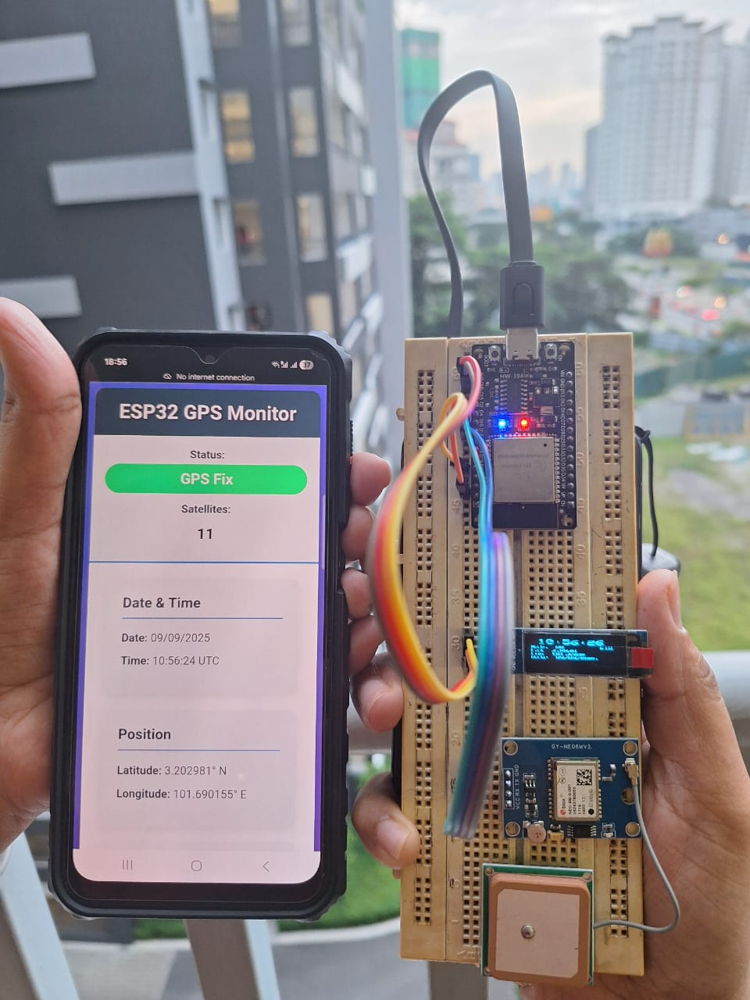
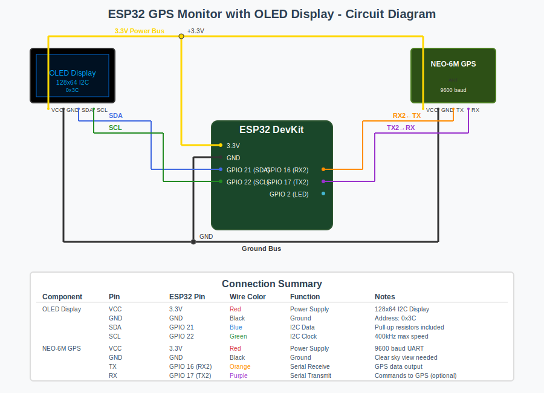

# 🌍 ESP32 GPS Monitor with OLED Display & WiFi Dashboard

> Real-time GPS monitoring system with an OLED display and WiFi dashboard, built on **ESP32 + NEO-6M GPS**.

---

## ✨ Project Story – From Curiosity to Creation

This project didn’t start with a circuit diagram.
It started with a **simple question from my 6-year-old** while riding the MRT in Malaysia:

> "තාත්තා, how do all the lights on those tall buildings blink together?"

I didn’t have an answer at the time. Later, I discovered that many skyscraper lights are actually synchronized using **GPS signals**.
Each light gets a precise time signal, so they blink in perfect unison — like the city itself is breathing.

That small discovery lit a spark 💡. Why not build something ourselves using GPS?

📖 Read the backstory here: **A Little Question, A Big Wonder** (LinkedIn)  
https://www.linkedin.com/posts/hasithaprabhath_curiosity-parenting-diyprojects-activity-7360663645384593411-XU2c

What began as a child’s innocent curiosity has grown into this project: a **real-time GPS monitor** that displays data on an OLED screen and serves a live dashboard over WiFi.

---

## 🚀 Features
- 📡 **GPS Data Parsing** – UTC time, date, latitude, longitude, altitude, speed, and course.
- 🛰️ **Satellite Tracking** – Satellite count, fix quality, and fix status.
- 🖥️ **OLED Display** – Minimal, glanceable UI for live data.
- 🌐 **WiFi Web Dashboard** – ESP32 runs as an Access Point with a responsive dashboard.
- 🔴 **LED Fix Indicator** – Slow blink = GPS fix, fast blink = searching.
- 🔒 **Offline Mode** – Works without internet (local WiFi AP mode).

---

## 🛠️ Hardware Requirements
- **ESP32 DevKit V1**
- **NEO-6M GPS Module** (**3.3V power only ⚠️**)
- **SSD1306 OLED Display** (128x64, I2C)
- USB cable for flashing & power

---

## 🔌 Demo

 
 

---

## 🔌 Circuit Diagram




---

## 🌐 WiFi Access Point Details
- **SSID:** `ESP32_GPS_Monitor`
- **Password:** `gps123456`
- **Access URL:** `http://192.168.4.1`

The ESP32 hosts a small web server with three routes:
- `/` – dashboard (HTML + JS auto-refresh every 2s)
- `/data` – returns live JSON (time, date, coordinates, speed, fix info)
- `/style.css` – lightweight styling for the dashboard

---

## 🖥️ Web Dashboard
The dashboard shows:
- **Status Bar** – GPS Fix vs No Fix, Satellite count
- **Date & Time** – UTC from GPS
- **Position** – Latitude & Longitude (DMS → decimal conversion handled in code)
- **Measurements** – Altitude (m), Speed (km/h), Course (deg)
- **Signal Info** – Fix quality, Fix status, Last update timestamp

> The OLED updates ~every 500 ms; the browser fetches `/data` every 2 seconds.

---

## 📂 Project Files
- `esp32_gps.ino` → Main Arduino sketch (GPS parsing, OLED UI, WiFi server).
- `docs/circuit-diagram.svg`

---

## 🚀 Getting Started

1. **Clone**
   ```bash
   git clone https://github.com/hasithaishere/esp32-gps-oled-wifi-monitor.git
   cd esp32-gps-oled-wifi-monitor
   ```

2. **Install Arduino libraries**
   - `Adafruit SSD1306`
   - `Adafruit GFX`
   - `WiFi`
   - `WebServer`

3. **Wire up** GPS & OLED as per the diagram.

4. **Flash** the sketch `esp32_gps.ino` to your ESP32 (Board: *ESP32 Dev Module*).

5. **Connect** to the ESP32 WiFi AP:
   - SSID: `ESP32_GPS_Monitor`
   - Password: `gps123456`

6. **Open** `http://192.168.4.1` in your browser to view live data.

---

## 🧠 How It Works (Quick Technical Notes)

- **Serial & Parsing**: GPS NMEA sentences are read from UART2 and parsed for `GGA`, `RMC`, and `GSV`. Time/position are decoded; speed in knots is converted to km/h.
- **Coordinate Conversion**: Raw `ddmm.mmmm` / `dddmm.mmmm` are converted to decimal degrees with hemisphere sign handling (S/W negative).
- **Staleness & Fix**: If no sentence is received for 5s, the system flags `hasValidFix = false`. LED blink interval is tied to fix status.
- **OLED UI**: Large time header with supporting rows for sats/lat/lon/date for quick glances.
- **Web API**: `/data` returns a compact JSON snapshot for simple integrations or future logging.

---

## 🔮 Roadmap / Ideas
- Log GPS tracks to SD card (CSV/GeoJSON)
- Google Maps integration for live plotting
- NTP fallback for time when under poor sky view
- Turn the dashboard into a PWA (installable on phones)
- Add PPS pin handling for timing experiments

---

## 📜 License
MIT License © Hasitha Prabhath Gamage

---

> Sometimes, the best engineering projects start with the smallest voices — in this case, a child’s question about blinking lights.
